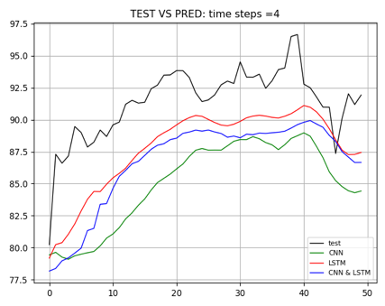

# Stock-Price-Prediction
If you would like to try our code, just download all and run the main file.
## Table of content
* [Why are we interested in stock price prediction?](#abstract)
* [Introduction](#overview)
* [The data](#thedata)
    * [Technical indicators](#technicalind)
* [Model Explanation](#Model)
    * [Model Explanation LSTM continued](#Model.c)
    * [1D-CNN](#cnn)
    * [Test trading](#trading)
* [Results](#Result)
* [Conclusion](#Conclusion)
* [Disclaimer](#disclaimer)

# 1. Why are we interested in stock price prediction? <a class="anchor" id="abstract"></a>
Stock return forecasting is one of the core issues in financial research. It is closely related to many important financial issues, such as portfolio management, capital cost and market efficiency.The financial market tremendously impacts our daily lives in many perspectives. Our group wants to forecast the stock through the sequential data. People invest in exchange-traded funds against the inflation rate. Netflix produces TV series to reveal Wall Street’s life. Time series forecasting is one of the most challenging missions by deep learning. In this research, we aim to find an appropriate model for stock price prediction along with a profit-maximizing trading strategy. Long short term memory is the main technique used on the targets of stock price of two corporations: The Procter & Gamble Company and Bank of America. As comparison, some data de-noising is finished by one-dimension residual convolutional networks before passing into the LSTM as input features. Final results show that CNN successfully tackles random noise problems and uncertain information in time series but a single LSTM expresses a better performance.

Honestly speaking, we would like to apply netural networks on stock data to make some prediction on stock price. Try to find some chances to earn some money in the market. This is our inital thoughts. 
# 2. Introduction <a class="anchor" id="overview"></a>
Many parametric approaches are developed but fail to produce precise results. Instead, long short term memory in deep learning allows nonlinear characters and leads to a higher predictive accuracy. Some researchers also utilize the convolutional neural networks to solve the problem of noise in the waveform data. Our group aims to compare the prediction of future prices of The Procter & Gamble Company (PG) and Bank of America (BAC). The work is done by grid search on different parameters for LSTM only or combined CNN & LSTM model

## 2.1. Idea of financial Market: 

"Buy low, sell high" is the oldest and the most famous criterion in the market. However, the real world is more complicated. In order to mimic transactions as close as the reality, four trading strategies are developed. In other words, the ultimate objective of this experiment is to maximize profits based on the outputs and strategies.

# 3. Dataset <a class="anchor" id="thedata"></a>

Our group aims to compare the prediction of future prices of The Procter & Gamble Company (PG) and Bank of America (BAC). The work is done by grid search on different parameters for LSTM only or combined CNN & LSTM model. By understanding the behaviors of the stock, investors may improve their investment decisions.

```python
import numpy as np
import pandas as pd
import yfinance as yf
import ta as ta
from ta import add_all_ta_features
from ta.utils import dropna
from ta.volatility import BollingerBands
import tensorflow as tf
from pandas_datareader import data as pdr
import matplotlib.pyplot as plt
import tensorflow as tf
import torch

data = yf.download("PG", start="2017-01-01", end="2019-01-01")
data2 = yf.download("SPY", start="2017-01-01", end="2019-01-01")
pd.DataFrame(data)
```

Our data is the historical daily stock price of PG and BAC from 01/01/2017 to 01/01/2019, downloaded from Yahoo Finance. The datasets include a daily open price, the daily highest price, the daily lowest price, a close price, an adjusted close price and the volume.

<center></img></center>

_figure 1: sample data_

<center></img></center>

_figure 2: close price for PG_

<center></img></center>

_figure 3: close price for BAC_

## 3.1. Technical indicators <a class="anchor" id="technicalind"></a>
5 days and 100 days moving averages are applied to smooth temporary and random price fluctuations over time. A buy signal happens when the short-duration MA crosses above the long-duration MA. In professional terms, this is called a "golden cross." On the contrary, the trend of price drops and generates a sell signal when two lines cross the other way. This is known as a "dead cross. " Some other technical indicators tracked are Average True Range, Bollinger Bands, Rate of Change, Force Index, Williams percentage Range and Moving Average Convergence Divergence. The third dataset is the S&P 500 in Figure 5, as a benchmark to represent the overall economy.

A lot of investors follow technical indicators. We included the most popular indicators as independent features.

**NOTE:** We are not showing Technical Indicator Graphs here. Since They will be shown in our report. 

# 4. Model Explanation <a class="anchor" id="Model"></a>

## 4.1 Model Explanation LSTM <a class="anchor" id="Model"></a>

Long short term memory is similar to Recurrent Neural Network (RNN) in deep learning. It captures dynamic nonlinear characters and transfers previous relevant things to the present.

<center></img></center>

_figure 4:  architecture of LSTM_


## 4.2 Model Explanation LSTM continued  <a class="anchor" id="Model.c"></a>

As the new information flows through different gates (the input gate zi , the forget gate zf and the output gate zo) in memory blocks, it is read, forgotten and stored. Then, the cell state and the hidden state are updated and transferred to the next cell. For instance, previous cell state ct-1 is used to store the information kept from the last step: an increasing trend of the stock price in the past. Previous hidden state ht-1 is used to receive outputs from last cells: the closing price of the stock yesterday. Next, they are combined with the current input state at xt, which can fresh information: an unexpected major personnel change today. Finally, an accurate output is received.


## 4.3 1D-CNN  <a class="anchor" id="cnn"></a>

CNN is famous for diagram recognization. But Can be also used in dimentional reduction or feature aggregation. So we are going to pass features into sparse autoencoders with a convolution neural network through a 1 dimension convolution layer and global max-pooling layer before LSTM, we can reduce overfitting and improve forecasting performance if we can.

## 4.4 Test trading  <a class="anchor" id="trading"></a>

Four trading algorithms are developed with an initial capital of $1000 in the research in comparison of the rate of returns by different models and parameters. 

<center></img></center>

# 5. Results <a class="anchor" id="Result"></a>

We used permutation method before, and with permutation every steps and every movement can be perfectly predicted. But the method could be somehow not correct. Therefore we get rid of permutation. 

## 5.1 Test data against Predicted values in PG and BAC


<center></img></center>
<center></img></center>

The black line represents our test data, the solid line is the result of using CNN combined with the LSTM model, and the dotted line is the result of using only the LSTM model. Different colors represent different memory times in our model. From the images, we can see that the prediction value of LSTM model is closer to our test value than that of CNN + LSTM, showing that LSTM performs better. In terms of prediction trend accuracy, both models have overall good trend prediction, In terms of trend prediction, the performance of the two models is generally good. There is no obvious difference in prediction when adjusting memory time. 

## 5.2 Loss function comparison


<center></img></center>
<center></img></center>

<center></img></center>
<center></img></center>

Our purpose is to use CNN to make the factors in stock can be integrated and produce the effect of dimension reduction, so as to achieve the effect of denoise. From table 1, No matter which timestep is used, the MSE of CNN with LSTM model is higher than CNN & LSTM. From the image of loss function, we can also find that the LSTM model converges faster than CNN & LSTM and MSE is relatively smaller.

## 5.3 Test the earnings in using different models and strategies

<center></img></center>

Table 2 is the rate of return using 4 strategies. Most of the rates of return are positive using all in strategy, however this trading strategy is risky because people are likely to lose the majority of principles in early stages if the model prediction is not accurate enough. The second and third approach are both conservative, but the daily investment method can test if our model is correctly predicted on the trends, and this strategy can be said as the best one and proves that LSTM performs relatively better than CNN.

# 6. Conclusion and Discussion <a class="anchor" id="Conclusion"></a>

In summary, we address the implementation and the comparison of CNN and LSTM to financial time series prediction. As results discussed above, the strategy based on the prediction of a single LSTM outperforms with a relatively higher cumulative returns. One of the reasons that impacts of CNN are not obvious is a lack of features and noises in this experiment. Due to the computational limitation, a limited number of model parameters is trained. Therefore, future study will introduce more random noises and parameters values. Also, we can build more professional trading algorithms with prior knowledge to create profitable portfolios, then we can step up some API calls to create real accounts to perform day trading in the real market. 

