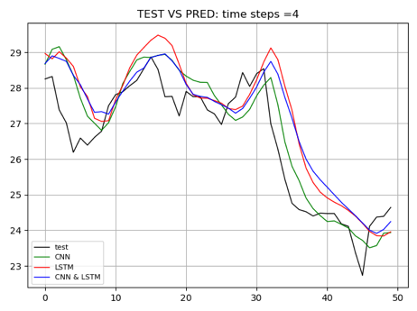

# Stock-Price-Prediction

If you would like to try our code, just download all and run the main file.

``` python
python main.py
```

There are two things we can adjut for, one is time steps(in parameter called TIMESTEP, need to be even number and greater than 2) and the other one is change model since we have 3 different models. 

``` python
    # comment here to change models
    # model = create_cnn_model()
    # model = create_lstm_model()
    model = create_cnn_lstm_model()
```
From line 28-31 at main file. 

It's already aggregated enough for now, but we can still imporve these using arguements or parse. Due to the time constrat, we will do this next time. 

## Table of content
* [Why are we interested in stock price prediction?](#abstract)
* [Introduction](#overview)
* [The data](#thedata)
    * [Technical indicators](#technicalind)
* [Model Explanation](#Model)
    * [Model Explanation LSTM continued](#Model.c)
    * [1D-CNN](#cnn)
    * [Test trading](#trading)
* [Results](#Result)
* [Conclusion](#Conclusion)
* [Disclaimer](#disclaimer)

# 1. Why are we interested in stock price prediction? <a class="anchor" id="abstract"></a>
Stock return forecasting is one of the core issues in financial research. It is closely related to many important financial issues, such as portfolio management, capital cost and market efficiency.The financial market tremendously impacts our daily lives in many perspectives. Our group wants to forecast the stock through the sequential data. People invest in exchange-traded funds against the inflation rate. Netflix produces TV series to reveal Wall Street’s life. Time series forecasting is one of the most challenging missions by deep learning. In this research, we aim to find an appropriate model for stock price prediction along with a profit-maximizing trading strategy. Long short term memory is the main technique used on the targets of stock price of two corporations: The Procter & Gamble Company and Bank of America. As comparison, some data de-noising is finished by one-dimension residual convolutional networks before passing into the LSTM as input features.

Honestly speaking, we would like to apply netural networks on stock data to make some prediction on stock price. Try to find some chances to earn some money in the market. This is our inital thoughts. 
# 2. Introduction <a class="anchor" id="overview"></a>
Many parametric approaches are developed but fail to produce precise results. Instead, long short term memory in deep learning allows nonlinear characters and leads to a higher predictive accuracy. Some researchers also utilize the convolutional neural networks to solve the problem of noise in the waveform data. Our group aims to compare the prediction of future prices of The Procter & Gamble Company (PG) and Bank of America (BAC). The work is done by grid search on different parameters for LSTM only, CNN only or combined CNN & LSTM model

## 2.1. Idea of financial Market: 

"Buy low, sell high" is the oldest and the most famous criterion in the market. However, the real world is more complicated. In order to mimic transactions as close as the reality, four trading strategies are developed. In other words, the ultimate objective of this experiment is to maximize profits based on the outputs and strategies.

# 3. Dataset <a class="anchor" id="thedata"></a>

Our group aims to compare the prediction of future prices of The Procter & Gamble Company (PG) and Bank of America (BAC). The work is done by grid search on different parameters for LSTM only or combined CNN & LSTM model. By understanding the behaviors of the stock, investors may improve their investment decisions.

```python
import numpy as np
import pandas as pd
import yfinance as yf
import ta as ta
from ta import add_all_ta_features
from ta.utils import dropna
from ta.volatility import BollingerBands
import tensorflow as tf
from pandas_datareader import data as pdr
import matplotlib.pyplot as plt
import tensorflow as tf
import torch

data = yf.download("PG", start="2017-01-01", end="2019-01-01")
data2 = yf.download("SPY", start="2017-01-01", end="2019-01-01")
pd.DataFrame(data)
```

Our data is the historical daily stock price of PG and BAC from 01/01/2017 to 01/01/2019, downloaded from Yahoo Finance. The datasets include a daily open price, the daily highest price, the daily lowest price, a close price, an adjusted close price and the volume.

<center></img></center>

_figure 1: sample data_

<center></img></center>

_figure 2: close price for PG_

<center></img></center>

_figure 3: close price for BAC_

## 3.1. Technical indicators <a class="anchor" id="technicalind"></a>
5 days and 100 days moving averages are applied to smooth temporary and random price fluctuations over time. A buy signal happens when the short-duration MA crosses above the long-duration MA. In professional terms, this is called a "golden cross." On the contrary, the trend of price drops and generates a sell signal when two lines cross the other way. This is known as a "dead cross. " Some other technical indicators tracked are Average True Range, Bollinger Bands, Rate of Change, Force Index, Williams percentage Range and Moving Average Convergence Divergence. The third dataset is the S&P 500 in Figure 5, as a benchmark to represent the overall economy.

A lot of investors follow technical indicators. We included the most popular indicators as independent features.

**NOTE:** We are not showing Technical Indicator Graphs here. Since They will be shown in our report. 

# 4. Model Explanation <a class="anchor" id="Model"></a>

## 4.1 Model Explanation LSTM <a class="anchor" id="Model"></a>

Long short term memory is similar to Recurrent Neural Network (RNN) in deep learning. It captures dynamic nonlinear characters and transfers previous relevant things to the present.

<center></img></center>

_figure 4:  architecture of LSTM_


## 4.2 Model Explanation LSTM continued  <a class="anchor" id="Model.c"></a>

As the new information flows through different gates (the input gate zi , the forget gate zf and the output gate zo) in memory blocks, it is read, forgotten and stored. Then, the cell state and the hidden state are updated and transferred to the next cell. For instance, previous cell state ct-1 is used to store the information kept from the last step: an increasing trend of the stock price in the past. Previous hidden state ht-1 is used to receive outputs from last cells: the closing price of the stock yesterday. Next, they are combined with the current input state at xt, which can fresh information: an unexpected major personnel change today. Finally, an accurate output is received.


## 4.3 1D-CNN  <a class="anchor" id="cnn"></a>

CNN is famous for diagram recognization. But Can be also used in dimentional reduction or feature aggregation. So we are going to pass features into sparse autoencoders with a convolution neural network through a 1 dimension convolution layer and global max-pooling layer before LSTM, we can reduce overfitting and improve forecasting performance if we can.

CNN or Convolutional Neural Network is also a big innovation in machine learning, with most applications in image recognition, image classification and natural language processing. However, with recent breakthroughs in data science, some studies show a better performance of convolutional neural networks in stock prices modeling compared with RNN. The advantage is especially reflected in “automatically and adaptively learning in spatial hierarchies of features through a backpropagation algorithm” [Rikiya et al., 2018]. Specifically, if features are not informative enough, they may hinder the extraction. A total number of 5 layers in CNN are constructed.(More details in the report.)

After transformations through each layer, the number of parameters that must be learned are decreased. Therefore, we can reduce the risk of overfitting and improve forecasting performance. 

## 4.4 CNN + LSTM  <a class="anchor" id="cnn"></a>

Traditional methods such as weighted moving average are largely introduced to smooth and de-noise datasets. The one-dimensional convolution is defined in Eq. (2)(detail in the report), where f is the input vector with length n and g is the kernel with length m. According to formula, the convolution operation can be viewed as a smoothing operator if the parameters are all positive, and hence, we propose to employ a CNN as a deeper input gate before LSTM to learn smoothing parameters from the inputs. Note that previous work already shows that by reducing the dimension, an “important” input gate before the LSTM will benefit the modeling of temporal structures of LSTM [Graves et al., 2013; Wu et al., 2018].

## 4.5 Test trading  <a class="anchor" id="trading"></a>

Four trading algorithms are developed with an initial capital of $1000 in the research in comparison of the rate of returns by different models and parameters. 

<center></img></center>

# 5. Results <a class="anchor" id="Result"></a>

We used permutation method before, and with permutation every steps and every movement can be perfectly predicted. But the method could be somehow not correct. Therefore we get rid of permutation. 

## 5.1 Test data against Predicted values in PG and BAC


<center></img></center>
<center></img></center>
_We only updated 2 pics here with timestep = 4 for both stock_

As shown in Figure 7-12, We tuned the time steps of 4, 14 and 24 days to see if the memory time would affect the predictions on three methods. The black line indicates our test data, and the predictive curves for each market index are represented by solid lines in different colors. According to these plots, we observe that the curve of the CNN model is much closer to our actual values than that of the other two approaches. For BAC, the curve of LSTM occasionally derives far from the test values during the test period, while CNN+LSTM performs the worst in most cases. As for PG, the observations are inverse. In terms of price trend prediction, the performance of all three models is generally good. On the other hand, there is no obvious difference in outputs when adjusting memory time. Recall that in the combined model, we employ a CNN before passing into LSTM. We can conclude that CNN successfully brings the benefits of overfitting reduction and data de-noising. Even though, its forecast still turned worse in the end.

## 5.2 Loss function comparison


<center></img></center>
<center></img></center>

<center></img></center>

Our purpose is to use CNN to make the factors in stock can be integrated and produce the effect of dimension reduction, so as to achieve the effect of denoise. From table 1, No matter which timestep is used, the MSE of CNN with LSTM model is higher than CNN & LSTM. From the image of loss function, we can also find that the LSTM model converges faster than CNN & LSTM and MSE is relatively smaller.

The evaluation metrics used for comparison are MSE and loss to reduce potential bias in the analysis. From Table 1, and loss function plots, on average, the lowest MSE was captured in CNN model, and the second best one occurred on the LSTM model for the index BAC. CNN+LSTM has the largest MSE around 0.0125, while its performance ranks the second for the index PG. In some cases, a closer predictive curve does not equal a higher prediction accuracy. Yet the accuracy and the correlation are positively correlated.

## 5.3 Test the earnings in using different models and strategies

<center></img></center>

Table 2 illustrates the rate of return using 4 indicated strategies above. Most of the rates of return are positive around 11% using all in/all out strategy in PG stock, but this trading strategy is risky because people are likely to lose the majority of principles in early stages if the model prediction is not accurate enough. On the contrary, by looking at BAC rate of returns, most strategies tend to have a deficit. The second and the third algorithm are both conservative, but the daily investment method can test our model prediction on trends as it highly depends on price movements each day. As for the last trading algorithm without using any models, it can generate profits if and only if the overall trend is increasing. Overall, from the model specific rate of returns, CNN and LSTM tend to have better performance in trading with more earnings and less financial loss.

# 6. Conclusion and Discussion <a class="anchor" id="Conclusion"></a>

In summary, we address the implementation and the comparison of CNN and LSTM to financial time series prediction. As discussed above, the trading system based on the prediction of a single CNN outperforms with a relatively higher cumulative returns compared to LSTM and CNN+LSTM. One of the reasons that impacts of CNN as a deeper input gate are not obvious is a lack of features and noises in this experiment. Moreover, our study length is only 2 year daily close price, therefore, one of the further improvements is the extension of study length and depth (i.e weekly, hourly trading). Due to the computational limitation, a limited number of model parameters is trained. Thus, future study will also introduce more random noises and parameters values. At the same time, we can take into account the effects of frequent transaction costs, build more professional trading algorithms with prior knowledge to create profitable portfolios, then step up some API calls to create real accounts to perform daily trading in the real market. 

